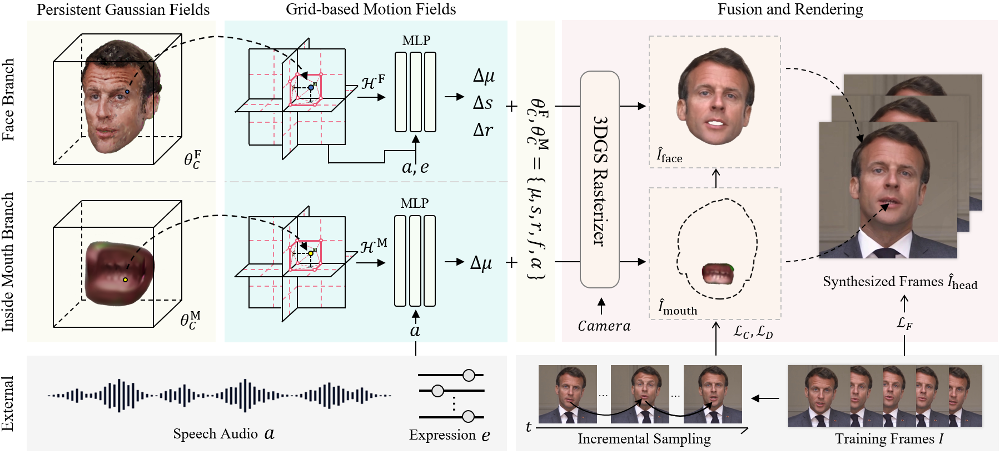

# TalkingGaussian: Structure-Persistent 3D Talking Head Synthesis via Gaussian Splatting

This is the official repository for our ECCV 2024 paper **TalkingGaussian: Structure-Persistent 3D Talking Head Synthesis via Gaussian Splatting**.

[Paper](https://arxiv.org/abs/2404.15264) | [Project](https://fictionarry.github.io/TalkingGaussian/) | [Video](https://youtu.be/c5VG7HkDs8I)



## Installation

Tested on Ubuntu 18.04, CUDA 11.3, PyTorch 1.12.1

```
git clone git@github.com:Fictionarry/TalkingGaussian.git --recursive

conda env create --file environment.yml
conda activate talking_gaussian
pip install "git+https://github.com/facebookresearch/pytorch3d.git"
pip install tensorflow-gpu==2.8.0
```

If encounter installation problem from the `diff-gaussian-rasterization` or `gridencoder`, please refer to [gaussian-splatting](https://github.com/graphdeco-inria/gaussian-splatting) and [torch-ngp](https://github.com/ashawkey/torch-ngp).

### Preparation

- Prepare face-parsing model and  the 3DMM model for head pose estimation.

  ```bash
  bash scripts/prepare.sh
  ```

- Download 3DMM model from [Basel Face Model 2009](https://faces.dmi.unibas.ch/bfm/main.php?nav=1-1-0&id=details):

  ```bash
  # 1. copy 01_MorphableModel.mat to data_util/face_tracking/3DMM/
  # 2. run following
  cd data_utils/face_tracking
  python convert_BFM.py
  ```

- Prepare the environment for [EasyPortrait](https://github.com/hukenovs/easyportrait):

  ```bash
  # prepare mmcv
  conda activate talking_gaussian
  pip install -U openmim
  mim install mmcv-full==1.7.1

  # download model weight
  cd data_utils/easyportrait
  wget "https://rndml-team-cv.obs.ru-moscow-1.hc.sbercloud.ru/datasets/easyportrait/experiments/models/fpn-fp-512.pth"
  ```

## Usage

### Important Notice

- This code is provided for research purposes only. The author makes no warranties, express or implied, as to the accuracy, completeness, or fitness for a particular purpose of the code. Use this code at your own risk.

- The author explicitly prohibits the use of this code for any malicious or illegal activities. By using this code, you agree to comply with all applicable laws and regulations, and you agree not to use it to harm others or to perform any actions that would be considered unethical or illegal.

- The author will not be responsible for any damages, losses, or issues that arise from the use of this code. 

- Users are encouraged to use this code responsibly and ethically.

### Video Dataset
[Here](https://drive.google.com/drive/folders/1E_8W805lioIznqbkvTQHWWi5IFXUG7Er?usp=drive_link) we provide two video clips used in our experiments, which are captured from YouTube. Please respect the original content creators' rights and comply with YouTube’s copyright policies in the usage.

Other used videos can be found from [GeneFace](https://github.com/yerfor/GeneFace) and [AD-NeRF](https://github.com/YudongGuo/AD-NeRF). 


### Pre-processing Training Video

* Put training video under `data/<ID>/<ID>.mp4`.

  The video **must be 25FPS, with all frames containing the talking person**. 
  The resolution should be about 512x512, and duration about 1-5 min.

* Run script to process the video.

  ```bash
  python data_utils/process.py data/<ID>/<ID>.mp4
  ```

* Obtain Action Units
  
  Run `FeatureExtraction` in [OpenFace](https://github.com/TadasBaltrusaitis/OpenFace), rename and move the output CSV file to `data/<ID>/au.csv`.

* Generate tooth masks

  ```bash
  export PYTHONPATH=./data_utils/easyportrait 
  python ./data_utils/easyportrait/create_teeth_mask.py ./data/<ID>
  ```

### Audio Pre-process

In our paper, we use DeepSpeech features for evaluation. 

* DeepSpeech

  ```bash
  python data_utils/deepspeech_features/extract_ds_features.py --input data/<name>.wav # saved to data/<name>.npy
  ```

- HuBERT

  Similar to ER-NeRF, HuBERT is also available. Recommended for situations if the audio is not in English.

  Specify `--audio_extractor hubert` when training and testing.

  ```
  python data_utils/hubert.py --wav data/<name>.wav # save to data/<name>_hu.npy
  ```

### Data Loading

By default, we preload all the data into RAM for acceleration, but the consumption maybe unaffordable (about N x 32GB RAM for about N x 5k frames). 

(Experimental) You can try to set `preload=False` in the `scene/dataset_readers.py - readCamerasFromTransforms(·)` to load the data temporally per iteration to save the cost. As the trade-off, the speed could be slower.

### Train

```bash
# If resources are sufficient, partially parallel is available to speed up the training. See the script.
bash scripts/train_xx.sh data/<ID> output/<project_name> <GPU_ID>
```

### Test

```bash
# saved to output/<project_name>/test/ours_None/renders
python synthesize_fuse.py -S data/<ID> -M output/<project_name> --eval  
```

### Inference with Specified Audio

```bash
python synthesize_fuse.py -S data/<ID> -M output/<project_name> --use_train --audio <preprocessed_audio_feature>.npy
```

## Follow-Up 
- [2025/02/28] Our work [InsTaG](https://fictionarry.github.io/InsTaG/) at CVPR 2025 is released! 🔥

## Citation

Consider citing as below if you find this repository helpful to your project:

```
@inproceedings{li2024talkinggaussian,
  title={TalkingGaussian: Structure-Persistent 3D Talking Head Synthesis via Gaussian Splatting},
  author={Li, Jiahe and Zhang, Jiawei and Bai, Xiao and Zheng, Jin and Ning, Xin and Zhou, Jun and Gu, Lin},
  booktitle={European Conference on Computer Vision},
  pages={127--145},
  year={2024},
  organization={Springer}
}
```


## Acknowledgement

This code is developed on [gaussian-splatting](https://github.com/graphdeco-inria/gaussian-splatting) with [simple-knn](https://gitlab.inria.fr/bkerbl/simple-knn), and a modified [diff-gaussian-rasterization](https://github.com/ashawkey/diff-gaussian-rasterization). Partial codes are from [RAD-NeRF](https://github.com/ashawkey/RAD-NeRF), [DFRF](https://github.com/sstzal/DFRF), [GeneFace](https://github.com/yerfor/GeneFace), and [AD-NeRF](https://github.com/YudongGuo/AD-NeRF). Teeth mask is from [EasyPortrait](https://github.com/hukenovs/easyportrait). Thanks for these great projects!
